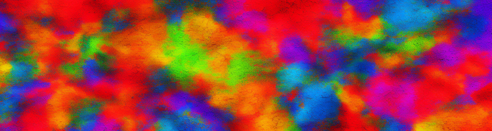
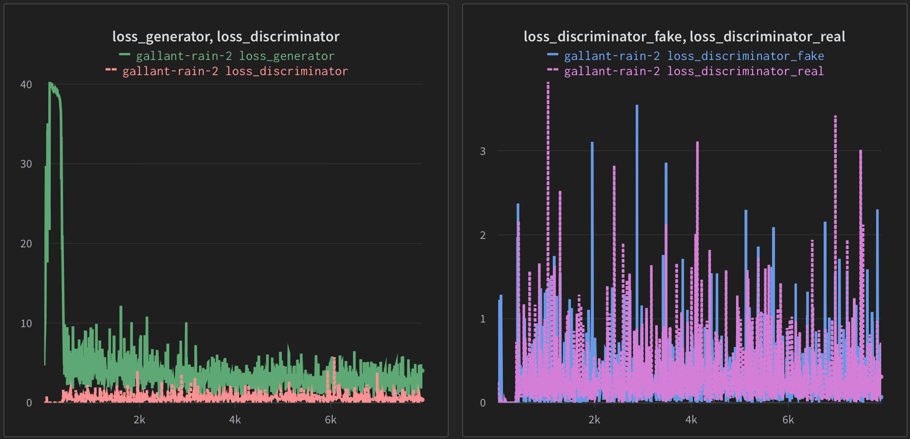

dcgan

A PyTorch implementation of [Unsupervised Representation Learning With Deep Convolutional Generative Adversarial Networks](https://arxiv.org/pdf/1511.06434.pdf)




 
### Installation
```
git clone https://github.com/andregaio/dcgan.git
cd dcgan
conda create -n dcgan python=3.8
conda activate dcgan
pip install -r requirements.txt
```

### Dataset
[Celeb-A Faces](http://mmlab.ie.cuhk.edu.hk/projects/CelebA.html) has been used for training. Download and unzip 'img_align_celeba.zip' from [Google Drive](https://drive.google.com/drive/folders/0B7EVK8r0v71pTUZsaXdaSnZBZzg?resourcekey=0-rJlzl934LzC-Xp28GeIBzQ) into the 'dataset' folder


### Models
 - DCGAN


### Training
```
python dcgan/train.py
```

### Inference
```
python dcgan/infer.py --weights weights/last_weights.pt --out test/image.png
```

### [Results](https://wandb.ai/andregaio/dcgan)
<div align="center">





</div>

### Notes
 - This is a refactored implementation of https://pytorch.org/tutorials/beginner/dcgan_faces_tutorial.html